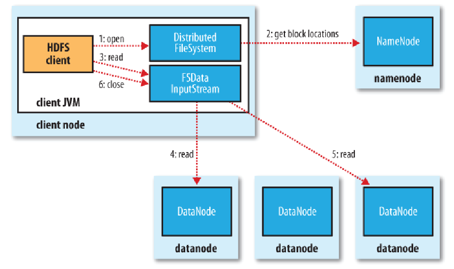

# Hadoop HDFS Data Read and Write Operations
## background 
- HDFS has a master and slave kind of architecture. Namenode acts as master and Datanodes as worker. All the metadata information is with namenode and the original data is stored on the datanodes. Keeping all these in mind the below figure will give idea about how data flow happens between the Client interacting with HDFS.

## read a file from HDFS
- step1:First the Client will open the file by giving a call to open() method on FileSystem object, which for HDFS is an instance of DistributedFileSystem class.

- step2:DistributedFileSystem calls the Namenode, using RPC (Remote Procedure Call), to determine the locations of the blocks for the first few blocks of the file. For each block, the namenode returns the addresses of all the datanodes that have a copy of that block. Client will interact with respective datanodes to read the file. Namenode also provide a token to the client which it shows to data node for authentication.

   - The DistributedFileSystem returns an object of FSDataInputStream(an input stream that supports file seeks) to the client for it to read data from FSDataInputStream in turn wraps a DFSInputStream, which manages the datanode and namenode I/O.
   
- step 3: The client then calls read() on the stream. DFSInputStream, which has stored the datanode addresses for the first few blocks in the file, then connects to the first closest datanode for the first block in the file.

- step 4: Data is streamed from the datanode back to the client, which calls read() repeatedly on the stream.

- step 5: When the end of the block is reached, DFSInputStream will close the connection to the datanode, then find the best datanode for the next block. This happens transparently to the client, which from its point of view is just reading a continuous stream.

- step 6: Blocks are read in order, with the DFSInputStream opening new connections to datanodes as the client reads through the stream. It will also call the namnode to retrieve the datanode locations for the next batch of blocks as needed. When the client has finished reading, it calls close() on the FSDataInputStream.
- 
 
## Data Write Operation
- Step 1: The client creates the file by calling create() method on DistributedFileSystem. 

- Step 2:   DistributedFileSystem makes an RPC call to the namenode to create a new file in the filesystem’s namespace, with no blocks associated with it.

   - The namenode performs various checks to make sure the file doesn’t already exist and that the client has the right permissions to create the file. If these checks pass, the namenode makes a record of the new file; otherwise, file creation fails and the client is thrown an IOException. TheDistributedFileSystem returns an FSDataOutputStream for the client to start writing data to.

- Step 3: As the client writes data, DFSOutputStream splits it into packets, which it writes to an internal queue, called the data queue. The data queue is consumed by the DataStreamer, which is responsible for asking the namenode to allocate new blocks by picking a list of suitable datanodes to store the replicas. The list of datanodes forms a pipeline, and here we’ll assume the replication level is three, so there are three nodes in the pipeline. TheDataStreamer streams the packets to the first datanode in the pipeline, which stores the packet and forwards it to the second datanode in the pipeline.

- Step 4: Similarly, the second datanode stores the packet and forwards it to the third (and last) datanode in the pipeline.

- Step 5: DFSOutputStream also maintains an internal queue of packets that are waiting to be acknowledged by datanodes, called the ack queue. A packet is removed from the ack queue only when it has been acknowledged by all the datanodes in the pipeline.

- Step 6: When the client has finished writing data, it calls close() on the stream.

- Step 7: This action flushes all the remaining packets to the datanode pipeline and waits for acknowledgments before contacting the namenode to signal that the file is complete The  namenode  already  knows  which blocks  the  file  is  made  up  of , so it only has to wait for blocks to be minimally replicated before returning successfully.
